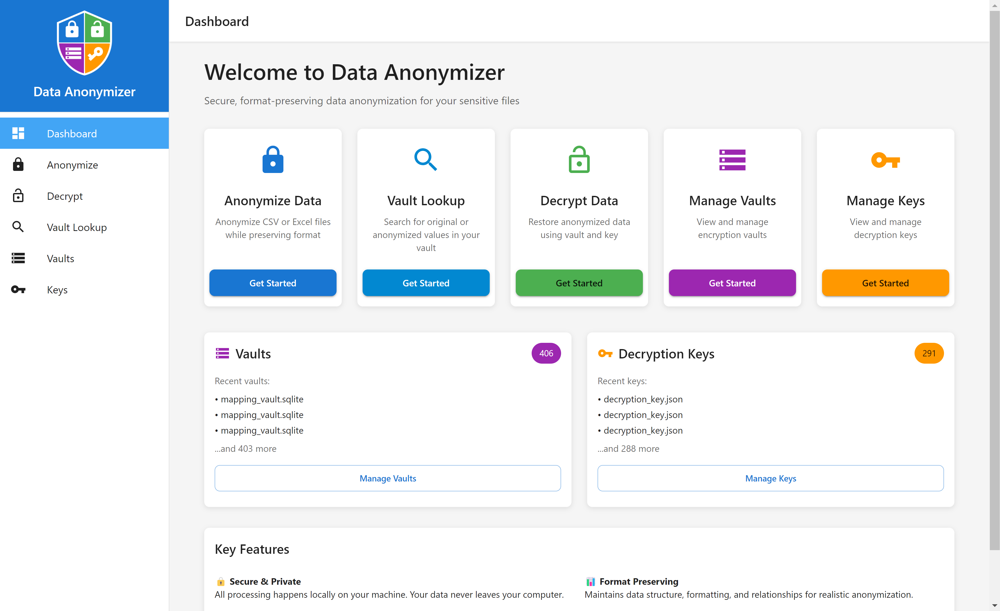
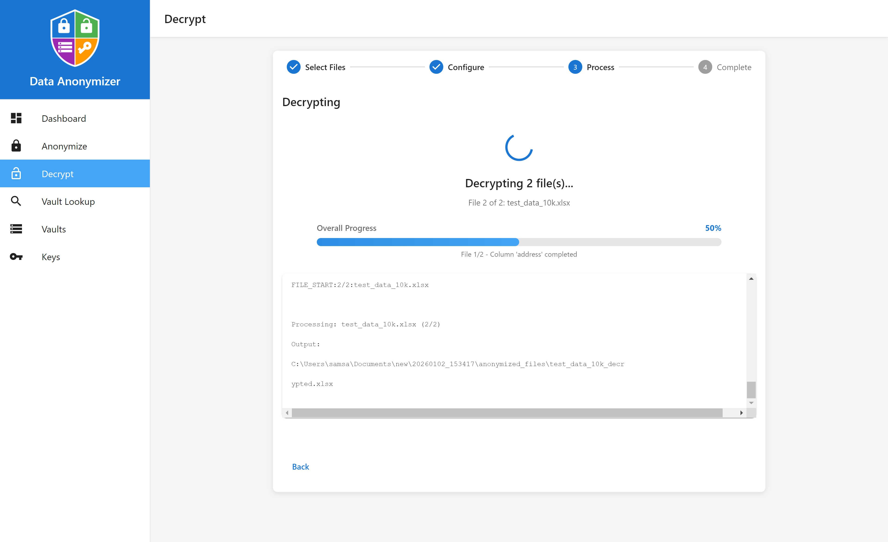

# Data Anonymizer                                                                  <div align="right"> [](https://github.com/KeyLayer/Data-Anonymizer/releases/latest) 

<div align="center">



**Professional desktop application for format-preserving data anonymization**

[](LICENSE.md)
[]()
[](https://github.com/KeyLayer/Data-Anonymizer/releases/latest)


[Features](features) • [Installation](installation) • [Quick Start](quick-start) 

</div>

---

## Overview

Data Anonymizer is a powerful desktop application that enables secure, format-preserving anonymization of sensitive data in CSV and Excel files. Built with enterprise-grade encryption and intelligent data detection, it provides a complete solution for GDPR compliance, test data generation, and secure data sharing.

**All processing happens locally on your machine** - your data never leaves your computer, ensuring maximum privacy and security.


## Features

### **Anonymize Data**
Transform sensitive data while preserving format, structure, and relationships.


- **Multi-step wizard** guides you through the entire process
- **Intelligent data type detection** automatically identifies emails, phones, names, addresses, credit cards, IBANs, UUIDs, dates, and more
- **Column selection interface** with confidence scores and data type indicators
- **Real-time preview** before processing
- **Progress tracking** with detailed logs


#### Supported File Formats
- CSV files (all encodings)
- Excel files (.xlsx, .xls, .xlsm, .xlsb, .ods)
- Multi-sheet Excel workbooks
- Large files with automatic chunking


### **Decrypt Data**
Restore anonymized data back to original values using encrypted vaults.


- **Automatic vault detection** finds associated decryption keys
- **Batch decryption** of multiple files
- **Seed auto-loading** from vault metadata
- **Progress tracking** with real-time updates




### **Vault Lookup**
Search and retrieve original or anonymized values from encrypted vaults.


Three powerful lookup modes:

1. **Forward Lookup** - Find anonymized value from original
2. **Reverse Lookup** - Find original value from anonymized
3. **Global Vault Search** - Search entire vault across all columns and data types


### **Vault Manager**
Centralized management of all encryption vaults.


- **Automatic vault discovery** scans output directories
- **Vault metadata** display (creation date, size, location)
- **Quick access** to vault folders
- **Vault deletion** with confirmation
- **Manual vault import** for external vaults

### **Key Manager**
Secure management of decryption keys.


- **Automatic key discovery** finds all decryption keys
- **Key metadata** display (creation date, size, location)
- **Quick access** to key folders
- **Key deletion** with security warnings
- **Manual key import** for external keys

### **Dashboard**
Central hub with quick access to all features and statistics.


- **Quick action cards** for all major features
- **Vault and key statistics** at a glance
- **Recent items** display
- **Feature highlights** and key benefits

## Anonymization Profiles

Choose from 5 pre-configured profiles optimized for different use cases:

### 1. **Default (Hybrid)** ⭐ Recommended
- **Best for:** General use with strong security and data utility
- **Technology:** Combines NIST SP 800-38G AES-FF3-1 encryption with Faker-generated synthetic data
- **Security:** AES-128-CBC encrypted vault with HMAC-SHA256 authentication
- **Reversible:** ✅ Yes
- **Use cases:** Production data sharing, analytics, reporting

### 2. **GDPR Compliant**
- **Best for:** Production data requiring GDPR/regulatory compliance
- **Technology:** NIST SP 800-38G compliant AES-FF3-1 format-preserving encryption
- **Security:** Maximum security with cryptographic guarantees
- **Reversible:** ✅ Yes (for authorized data subject access requests)
- **Use cases:** EU data processing, regulatory compliance, audit trails

### 3. **Referential Integrity**
- **Best for:** Related tables, foreign keys, multi-file analytics
- **Technology:** Hybrid transformer with consistent seeding
- **Security:** AES-128-CBC + HMAC-SHA256 with PBKDF2 key derivation
- **Reversible:** ✅ Yes
- **Use cases:** Database exports, multi-table datasets, maintaining relationships

### 4. **Test Data**
- **Best for:** Development, testing, demos, training datasets
- **Technology:** Faker library for realistic synthetic data generation
- **Security:** No vault storage (fully synthetic)
- **Reversible:** ❌ No (data is completely fabricated)
- **Use cases:** Non-production environments, demos, training

### 5. **Fast Hash**
- **Best for:** Large datasets prioritizing speed over reversibility
- **Technology:** HMAC-SHA256 cryptographic hashing
- **Security:** Deterministic but non-reversible
- **Reversible:** ❌ No
- **Use cases:** High-volume processing, one-way anonymization


## Anonymization Modes

Four transformation strategies for different security and utility requirements:

### 1. **Hybrid** (Recommended) 🌟
- Combines encryption with realistic fake data
- Best balance of security and data utility
- Vault-secured with AES-128 encryption
- Format-preserving and reversible

### 2. **Format-Preserving Fake**
- Generates synthetic values matching structure
- Realistic fake data using Faker library
- Maintains format, length, and patterns
- Vault-secured for consistency

### 3. **Format-Preserving Encryption (FPE)**
- NIST SP 800-38G compliant AES-FF3-1
- Cryptographic reversible encryption
- Exact format preservation
- Maximum security

### 4. **Seeded HMAC**
- Fast deterministic hashing
- HMAC-SHA256 cryptographic hashing
- Maintains referential integrity
- Non-reversible (one-way)

## Quick Start

## Installation

1. **Download** the installer for your platform
2. **Run** the installer and follow the setup wizard
3. **Launch** Data Anonymizer from your applications menu

### First Anonymization

1. **Click "Anonymize Data"** from the dashboard
2. **Upload your files** (CSV or Excel)
3. **Select a profile** (Default/Hybrid recommended)
4. **Choose columns** to anonymize (or use auto-detection)
5. **Preview** the changes
6. **Process** and save your anonymized files

Your anonymized files, vault, and decryption key will be saved in timestamped output folders.

## Key Concepts

### **Seeds**
Seeds make anonymization deterministic:
- Same seed + same value = same anonymized value
- Required for referential integrity across multiple files
- Auto-loaded from vault metadata during decryption

### **Vaults**
Encrypted SQLite databases storing original-to-anonymized mappings:
- Created automatically during anonymization
- Secured with AES-128-CBC encryption + HMAC-SHA256
- Required for decryption and lookups
- Can be reused across multiple anonymization runs

### **Decryption Keys**
JSON files containing vault encryption keys:
- Generated automatically with each vault
- Required for decryption operations
- Should be stored securely or use Password Only mode.
- ⚠️ **Keep these secure** - anyone with the key can decrypt your data

### **Profiles vs Modes**
- **Profiles** are pre-configured settings for specific use cases
- **Modes** are the underlying transformation algorithms
- Profiles combine modes with optimal settings for common scenarios

## Security Features

- **Local Processing** - All data stays on your machine
- **AES-128 Encryption** - Industry-standard vault encryption
- **HMAC-SHA256** - Message authentication for vault integrity
- **PBKDF2 Key Derivation** - 100,000 iterations (NIST SP 800-132 compliant)
- **Format-Preserving Encryption** - NIST SP 800-38G compliant FF3-1 algorithm
- **Secure Key Storage** - Separate key files with access controls

## Supported Data Types

Automatically detects and anonymizes:

- **Personal Information:** Names, emails, phone numbers, addresses
- **Financial Data:** Credit cards, IBANs, bank accounts
- **Identifiers:** UUIDs, GUIDs, SSNs, license plates
- **Dates & Times:** Various date formats with realistic shifts
- **Numeric Data:** Integers, decimals, percentages
- **Custom Patterns:** User-defined regex patterns

## Use Cases

### **GDPR Compliance**
- Pseudonymize personal data for analytics
- Maintain data subject access request capabilities
- Audit trail with encrypted vaults

### **Test Data Generation**
- Create realistic test datasets from production data
- Maintain referential integrity across tables
- Safe for development and QA environments

### **Data Sharing**
- Share datasets with partners without exposing sensitive information
- Preserve data utility for analytics
- Maintain format for existing tools and processes

### **Analytics & Reporting**
- Anonymize data while preserving statistical properties
- Enable data science on sensitive datasets
- Maintain relationships and patterns

## 🛠️ Advanced Features

### **Domain Preservation**
Maintain email domain grouping:
- `john@company.com` → `user123@company.com`
- Same domain = same anonymized domain
- Enables domain-level analytics

### **Multi-File Processing**
Process multiple files with shared vault:
- Automatic referential integrity
- Consistent anonymization across files
- Single vault for entire dataset

### **Excel Multi-Sheet Support**
- Process all sheets or select specific ones
- Preserve sheet structure and formatting
- Interactive sheet-by-sheet processing

### **Vault Reuse**
Use existing vaults for consistent anonymization:
- Maintain consistency across time periods
- Incremental data anonymization
- Shared mappings across projects

## Output Structure

```
output/
└── 20240101_120000/
    ├── anonymized_files/
    │   └── data.csv              # Your anonymized data
    ├── mapping_vault.sqlite      # Encrypted mappings
    ├── decryption_key.json       # ⚠️ Keep secure!
    ├── format_rules_used.json    # Configuration metadata
    └── validation_report.txt     # Processing summary
```

## System Requirements

- **Operating System:** Windows 10/11
- **Memory:** 2GB RAM minimum (4GB recommended for large files)
- **Storage:** 800MB for application + space for output files
- **Processor:** 64-bit processor

## Privacy & Security

- **No Internet Required** - Works completely offline
- **Zero Data Collection** - License verification only; your data remain completely private and local.
- **Local Processing** - All operations happen on your machine.
- **Open Algorithms** - Uses industry-standard encryption (NIST-compliant)
- **Secure by Design** - Encrypted vaults, separate key storage

## Support

For support, feature requests, or bug reports:
- **Email:** support@keylayer.com

## License

Proprietary software. See [LICENSE](LICENSE.md) for details.

---

<div align="center">

**Data Anonymizer [](https://github.com/KeyLayer/Data-Anonymizer/releases/latest)**

[](https://github.com/KeyLayer/Data-Anonymizer/releases/latest)

[Website](https://keylayer.com) • [Documentation](docs/) • [Support](mailto:support@keylayer.com)

</div>
